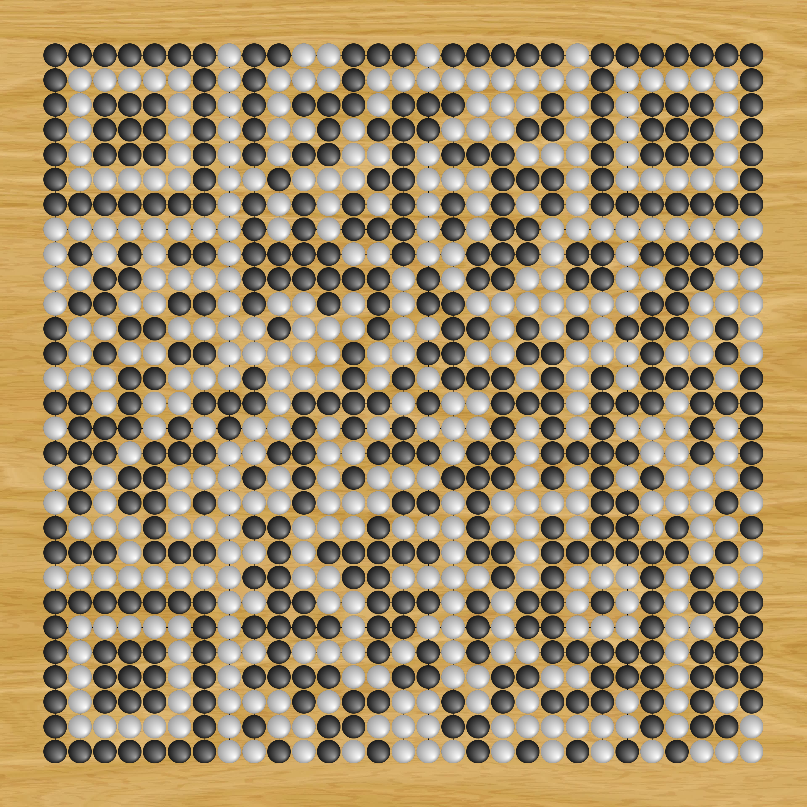

# Go Board QR Code Generator

This project generates a customizable Go board with an embedded QR code. The QR code can link to any desired URL, making it a unique tool for sharing information in a fun and interactive way.

## Features

- Customizable board size and grid size.
- Supports different backgrounds (color, texture, or transparent).
- Generates a QR code based on user-provided data.
- Saves the final image as a PNG file.

## Usage

1. Set the desired parameters for the Go board and QR code.
2. Run the program to generate the image.
3. The generated image will be saved as `go_qrcode.png`.

## Example

Here’s an example of a generated Go board with a QR code:



## Requirements

- Python 3.x
- PIL (Pillow)
- qrcode

## Installation

Install the required packages using pip:

```bash
pip install pillow qrcode
